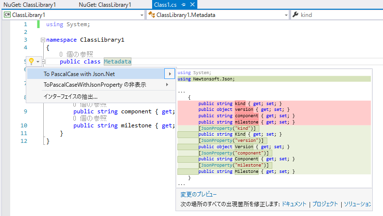

# ToPascalCaseWithJsonProperty

## install
```
PM> Install-Package Json.Net.Proprety.ToPascalCase
```
## Image


## Known Issue

- required Json.Net package (This package doesn't install Json.Net automatically.)
- Not adding "Newtonsoft.Json" using directive if the cs file has no using directive.
- Not considering re-action "To PascalCase with Json.Net".

